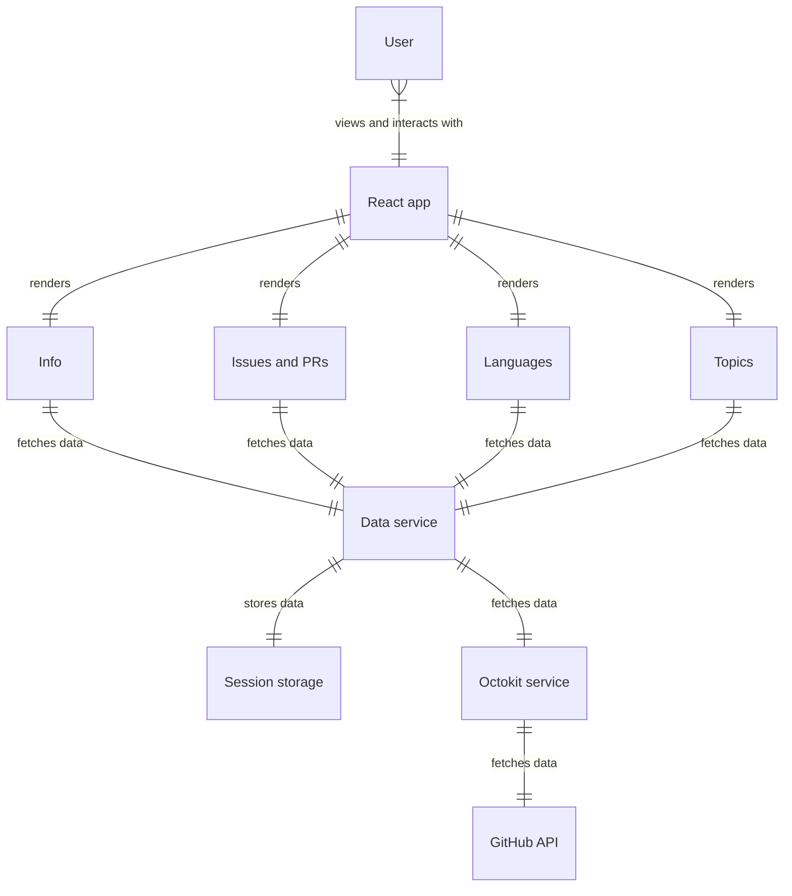
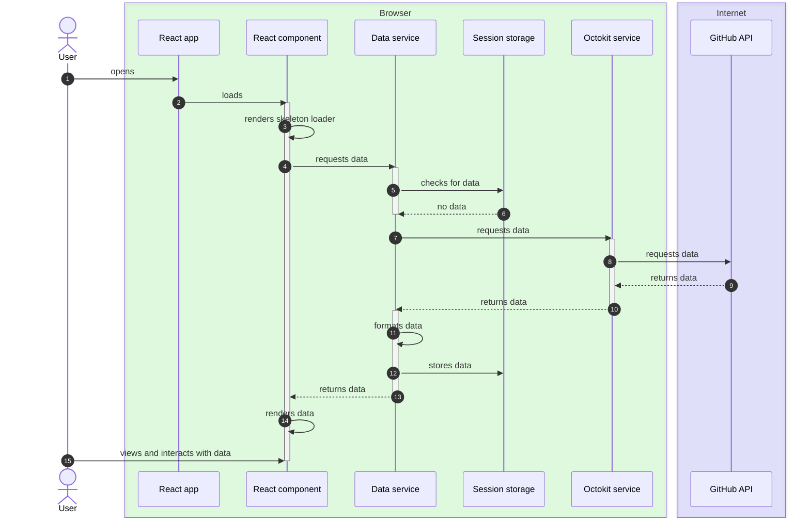
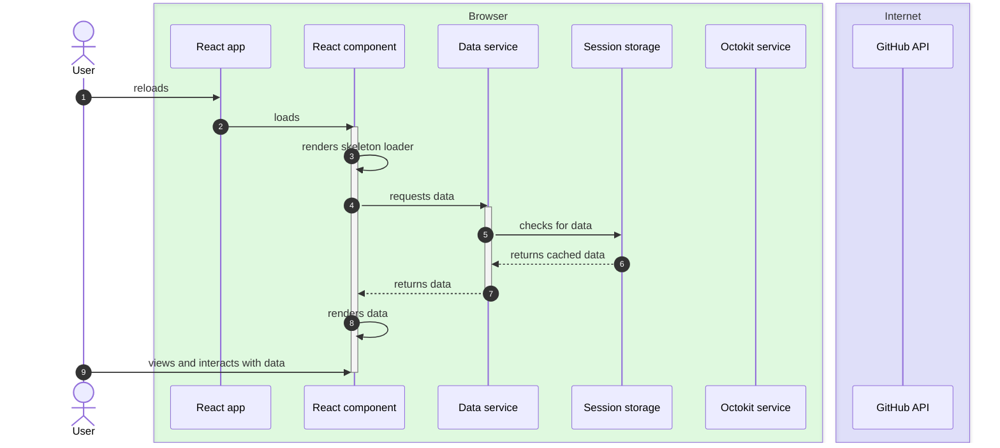

# Architecture

## Structure

### Components

**Directory**: [src/components](../src/components/)

The user interface is made up of various React components.

### Services

**Directory**: [src/services](../src/services/)

#### Data service

The data service formats and serves data to the components. It caches formatted data in the session storage or calls the Octokit service if no data is cached yet.

#### Octokit service

The Octokit service interacts with the [GitHub API](https://docs.github.com/en/rest) via the [Octokit.js](https://github.com/octokit/octokit.js) library. The sole responsibility of the Octokit service is to make API calls and pass the data back to the data service.

### Repositories

**Directory**: [src/repositories](../src/repositories/)

#### Session storage

Session storage is used to store the formatted data. It uses the [session storage](https://developer.mozilla.org/en-US/docs/Web/API/Window/sessionStorage) feature of modern web browsers.

## Data flow

### Opening the application

When a user (`User`) loads the application (`React app`) for the first time in their web browser, no data is being cached yet. This means that the data has to be fetched via the GitHub API.

### Reloading the page

After loading the application at least once, data is now being stored in the session storage. No additional requests are made via Octokit service to the GitHub API. There is also no need to format the data as the cached data is already formatted and ready to be rendered.

