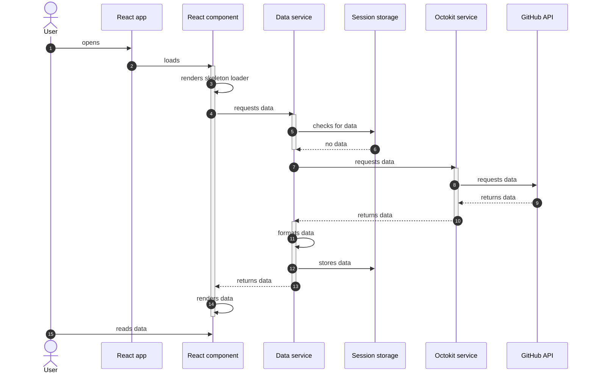

# Architecture

## Opening the application

The following sequence diagram demonstrates what happens when a user (`User`) loads the application (`React app`) for the first time. As the user is visiting the application for the first time, no data is cached yet.

