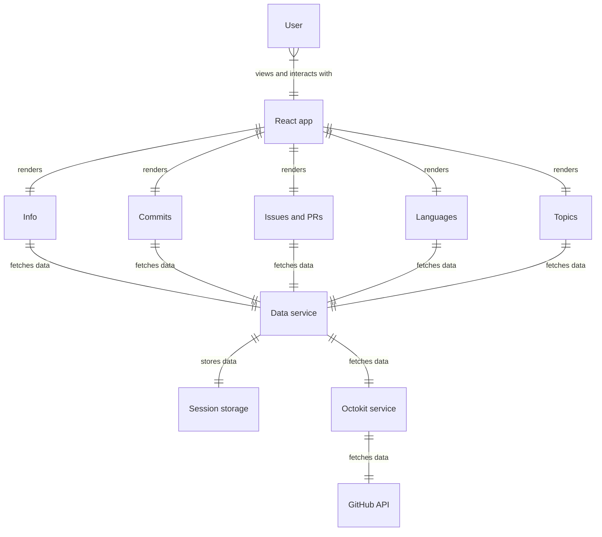
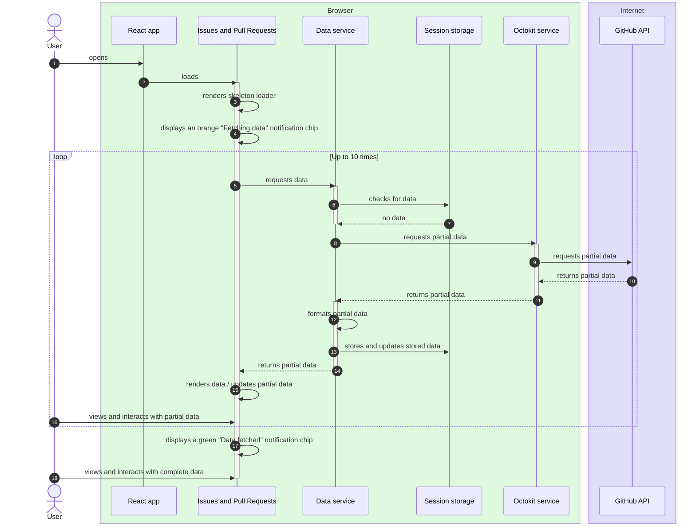

# Architecture

## Structure

### Components

**Directory**: [src/components](../src/components/)

The user interface is made up of various React components. The main components that display information are:

- [Info](../src/components/Info/)
  - Displays basic information about the user
    - Name
    - Username
    - Registration date
    - Location
- [Commits](../src/components/Commits/)
  - Displays commits made by the user as a line chart
    - By month
    - By year
- [Issues and PRs](../src/components/IssuesAndPullRequests/)
  - Displays the share of opened and closed issues or PRs as pie charts
- [Languages](../src/components/Languages/)
  - Displays the share of programming languages as a bar chart
    - By repository main language
    - By total number of bytes
- [Topics](../src/components/Topics/)
  - Displays the most used topics across all repositories as a word cloud

Each component is responsible for rendering one type of information. They may be made up of smaller sub-components.

### Services

**Directory**: [src/services](../src/services/)

#### Data service

The data service formats and serves data to the components. It caches formatted data in the session storage or calls the Octokit service if no data is cached yet.

#### Octokit service

The Octokit service interacts with the [GitHub API](https://docs.github.com/en/rest) via the [Octokit.js](https://github.com/octokit/octokit.js) library. The sole responsibility of the Octokit service is to make API calls and pass the data back to the data service.

### Repositories

**Directory**: [src/repositories](../src/repositories/)

#### Session storage

Session storage is used to store the formatted data. It uses the [session storage](https://developer.mozilla.org/en-US/docs/Web/API/Window/sessionStorage) feature of modern web browsers.

## Data flow

### Opening the application

When a user (`User`) loads the application (`React app`) for the first time in their web browser, no data is being cached yet. This means that the data has to be fetched via the GitHub API. The component (`React component`) could be any of the five main sections, they all work the same way but are used to display different types of information.

### Reloading the page

After loading the application at least once, data is now being stored in the session storage. No additional requests are made via Octokit service to the GitHub API. There is also no need to format the data as the cached data is already formatted and ready to be rendered.

### Incremental fetching

Due to the rate limits imposed on their API by GitHub, it is only possible to fetch up to 1000 data points per query. Only 100 results can be fetched per page so to fetch all 1000 results, a minimum of 10 GET requests must be made.

The `Issues and Pull Requests` component works this way. In the `Commits` component, the same process is repeated for each month as active users are likely to have made more than 1000 commits. If data is already stored in the session storage, only one request to data service is enough. See the previous diagram.

