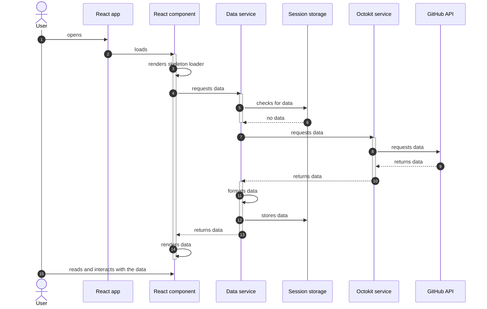
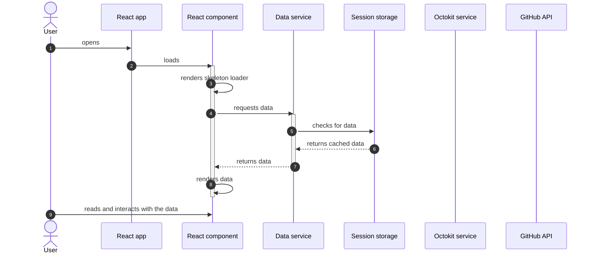

# Architecture

## Data flow

### Opening the application

The following sequence diagram demonstrates what happens when a user (`User`) loads the application (`React app`) for the first time. As the user is visiting the application for the first time, no data is cached yet.

### Reloading the page

As the data is cached in the session storage, reloading the page leads to the cached data being used. No additional requests are made via Octokit service to the GitHub API. There is also no need to format the data as the cached data is already formatted and ready to be rendered.

